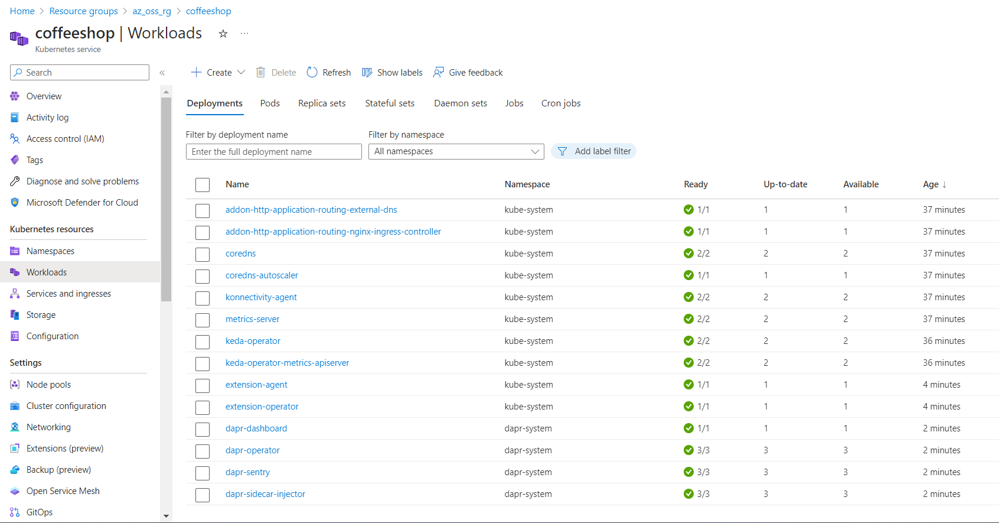

# coffeeshop-on-dapr

The .NET coffeeshop application runs on Dapr

# Services

<table>
    <thead>
        <td>No.</td>
        <td>Service Name</td>
        <td>URI</td>
    </thead>
    <tr>
        <td>1</td>
        <td>product-service</td>
        <td>http://localhost:5001</td>
    </tr>
    <tr>
        <td>2</td>
        <td>counter-service</td>
        <td>http://localhost:5002</td>
    </tr>
    <tr>
        <td>3</td>
        <td>barista-service</td>
        <td>http://localhost:5003</td>
    </tr>
    <tr>
        <td>4</td>
        <td>kitchen-service</td>
        <td>http://localhost:5004</td>
    </tr>
    <tr>
        <td>5</td>
        <td>reverse-proxy</td>
        <td>http://localhost:8080</td>
    </tr>
</table>

## Featured technologies

- [.NET 7](https://dotnet.microsoft.com/en-us/download/dotnet/7.0) - .NET is a free, cross-platform, open-source developer platform for building many different types of applications.
- [Bicep](https://docs.microsoft.com/en-us/azure/azure-resource-manager/bicep/overview) - Infrastructure as code
- [Bicep extensibility Kubernetes provider](https://learn.microsoft.com/en-us/azure/azure-resource-manager/bicep/bicep-extensibility-kubernetes-provider) - Model Kubernetes resources in Bicep
- [Azure Kubernetes Service](https://docs.microsoft.com/en-us/azure/aks/intro-kubernetes)
- [Azure Service Bus](https://docs.microsoft.com/en-us/azure/service-bus-messaging/service-bus-messaging-overview)
- [Dapr](https://dapr.io) - Microservice building blocks
- [KEDA](https://keda.sh) - Kubernetes event-driven autoscaling

## Architecture


## Pre-requisites

- [Azure subscription](https://azure.microsoft.com/free/)
  - **Note**: This application will create Azure resources that <font color=red>**will incur costs**</font>.
- [Azure CLI](https://docs.microsoft.com/cli/azure/install-azure-cli)
- [Dapr CLI](https://docs.dapr.io/getting-started/install-dapr-cli/)
- [Helm](https://helm.sh/docs/intro/install/)
- [Docker](https://docs.docker.com/get-docker/)
- [Dotnet SDK](https://dotnet.microsoft.com/download/dotnet/)
- [Bicep extensibility](https://learn.microsoft.com/en-us/azure/azure-resource-manager/bicep/bicep-extensibility-kubernetes-provider#enable-the-preview-feature)
- vscode extensions:
  - ms-vscode.azure-account
  - ms-azuretools.vscode-bicep
  - ms-kubernetes-tools.vscode-kubernetes-tools
  - humao.rest-client

## Get starting locally

```bash
> dapr init
> docker compose up 
```

Finally, you can play around using [client.http](client.http) to explore the application!

> Make sure no `redis`, `zipkin` instances running

## Get starting on Azure

1. Ensure you have access to an Azure subscription and the Azure CLI installed
   ```bash
   az login
   az account set --subscription "My Subscription"
   ```

1. Clone this repository
   ```bash
   git clone https://github.com/thangchung/coffeeshop-on-dapr.git
   cd coffeeshop-on-dapr
   ```

1. Install KEDA extension
   #### Enable KEDA extension [here](https://learn.microsoft.com/en-us/azure/aks/keda-deploy-add-on-arm)
   ```bash
   az feature register --namespace "Microsoft.ContainerService" --name "AKS-KedaPreview"
   ```

1. Deploy the infrastructure
   ```bash
   az deployment sub create --location eastus --template-file ./iac/bicep/main.bicep
   ```

1. Install Dapr extension
   #### Enable Dapr extension [here](https://docs.dapr.io/developing-applications/integrations/azure/azure-kubernetes-service-extension)
   ```bash   
   az k8s-extension create --cluster-type managedClusters --cluster-name coffeeshop --resource-group azure_oss_rg --name dapr --extension-type Microsoft.Dapr
   ```

1. Log into Azure Container Registry
   You can get your registry name from your resource group in the Azure Portal
   ```bash
   # enable admin login on Azure Portal
   docker login <registry_server_uri> -u <admin username> -p <password>
   ```

   > For example: <registry_server_uri> looks like `coffeeshopf2syic6ephtxk.azurecr.io`

1. Build and push containers

   Create an .env file at root project folder with content
   ```bash
   DOCKER_REGISTRY=<registry_server_uri>
   ```

   Then run docker-compose CLI as
   ```bash
   docker compose build
   docker push <registry_server_uri>/product-service:latest
   docker push <registry_server_uri>/counter-service:latest
   docker push <registry_server_uri>/barista-service:latest
   docker push <registry_server_uri>/kitchen-service:latest
   docker push <registry_server_uri>/reverse-proxy:latest
   ```

1. Get AKS credentials
   ```bash
   az aks get-credentials --resource-group az_oss_rg --name coffeeshop
   ```

   Make sure when you go to Azure Portal, you should see `keda` and `dapr` components as the picture below

   

1. Create dapr component on AKS
   ```bash
   kubectl apply -f iac/dapr/azure/orderup_pubsub.yaml
   kubectl apply -f iac/dapr/azure/barista_pubsub.yaml
   kubectl apply -f iac/dapr/azure/kitchen_pubsub.yaml
   ```

1. Deploy the application
   ```bash
   az deployment group create --resource-group az_oss_rg --template-file ./iac/bicep/app.bicep
   ```

1. Get your frontend URL
   ```bash
   kubectl get ingress
   ```

   For example,
   |NAME|CLASS|HOSTS|ADDRESS|PORTS|AGE|
   |---|---|---|---|---|---|
   |reverseproxy|<none>|app.5cde744b1d1242ffbc32.eastus.aksapp.io|20.241.232.155|80|13m|

8. Navigate to [client.http](client.http), and change `@host` to what you can see on previous command, for example: `app.5cde744b1d1242ffbc32.eastus.aksapp.io`, then play with REST APIs there. Enjoy!

## Clean up

   ```bash
   az group delete -n az_oss_rg
   ```

# Credits

- https://github.com/Azure-Samples/PetSpotR
